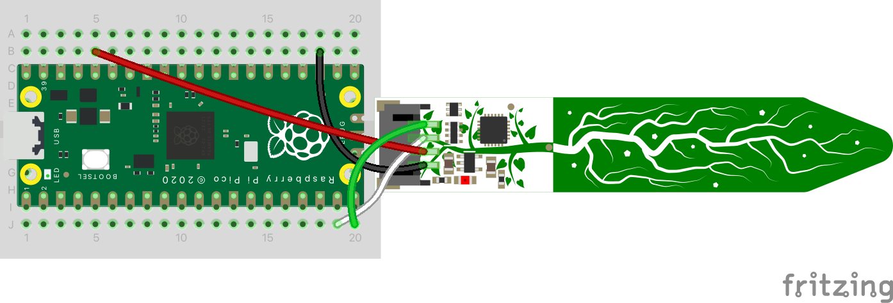

# bnbPlants
Say goodbye to dry plants and hello to bnbPlants: the witty, moisture-measuring marvel that keeps your green companions hydrated! bnbPlants measures soil moisture, offers a dashboard, and sends witty reminders to water your plants.

# Configure & Run Software
## Configure

If you have completed the setup of all the necessary hardware, firmware, and other components, and you simply want to execute the software and start the project:

main.py: 
Replace the following variables with your specific configuration:

1. **SSID**: Replace with your Wi-Fi network name
2. **PASSWORD**: Replace with your Wi-Fi password
3. **API_URL**: Replace with your Datacake API URL
4. **API_DEVICE**: Replace with your Datacake device ID

bnbPlants_bot.js: 
Replace the following variable with your specific configuration:

1. **TOKEN**: Replace with your Telegram bot token
   
Once these configurations have been added, the software should be ready to run.

## Run

Run `node bnbPlants_bot.js` in a terminal, then power up the Raspberry Pi Pico. That's it!


# Introduction
Discover the fascinating world of IoT with "bnbPlants," a project that originated during the summer course at Linnaeus University in 2023. This system effectively measures soil moisture and temperature and intelligently predicts the watering needs of your plants. The Raspberry Pi Pico serves as the core component, ensuring optimal growth and hydration for every plant in your garden.

# Objective
The "bnbPlants" project arose from a challenge faced by my mother in caring for the plants at our family's Airbnb property during the off-season summer months. Uncertain watering schedules led to stress and inefficiency. To tackle this issue, "bnbPlants" introduces a soil moisture system that not only monitors soil conditions and temperature but also predicts when the next watering is required. The project includes a user-friendly online dashboard, accessible at any time and from anywhere, providing real-time updates on the plants' needs. Additionally, it will send notifications via Telegram to the user when it's time to water the plants, making the task of plant care effortless and precise even for non-tech-savvy individuals.

# Materials
|Item|Cost (Sek)|
|:----:|:----:|
|[Raspberry Pi Pico WH](https://www.electrokit.com/produkt/raspberry-pi-pico-wh/)|99.19-109.00|
|Pico Power Supply|tbt|
|[Breadboard (270 connections)](https://www.electrokit.com/produkt/kopplingsdack-270-anslutningar/)|26.10-29.00|
|[Adafruit STEMMA Soil Sensor](https://www.electrokit.com/produkt/jordfuktighetssensor-kapacitiv-i2c/)|115.00|
|[JST PH 2mm 4-Pin to Female Socket Cable](https://www.electrokit.com/en/product/kabel-med-jst-ph-4-pol-hona-0-64mm-stift-200mm/)|24.00|

**Note:**
If you feel confident in your soldering skills, you can readily substitute the Raspberry Pi Pico WH, which comes with pre-soldered headers, with the Raspberry Pi Pico W, which does not have pre-soldered headers, as they are essentially the same.

# Putting It All Together

## Firmware
To successfully complete this project, you will need to have MicroPython installed on a Raspberry Pi Pico W board.

To download MicroPython with Wi-Fi support, press [here](https://micropython.org/download/rp2-pico-w/rp2-pico-w-latest.uf2)

Once you have downloaded MicroPython, please refer to the following video for detailed instructions on how to install MicroPython onto a Pico


More information can be found [here](https://www.raspberrypi.com/documentation/microcontrollers/micropython.html).

## Hardware

### Wiring 



Following Adafruit's [datasheet](https://learn.adafruit.com/adafruit-stemma-soil-sensor-i2c-capacitive-moisture-sensor/overview), and Raspberry Pi's [datasheet](https://datasheets.raspberrypi.com/picow/pico-w-datasheet.pdf?_gl=1*xj3ezv*_ga*MjYwNDYyMTE4LjE2ODY3MzQ5MjU.*_ga_22FD70LWDS*MTY4ODAzNzkxMC40LjEuMTY4ODAzODM2MC4wLjAuMA..) I ended up wiring as above.

|Pi Connection|Adafruit Connection|
|:----:|:----:|
|GP14|I2C SDA|
|GP15|I2C SCL|
|3v3(OUT)|VIN|
|GND|GND|


## Software
### Sensor and Pico Software
Crafting the software was a bit tricky with Adafruit's somewhat unclear [datasheet](https://learn.adafruit.com/adafruit-stemma-soil-sensor-i2c-capacitive-moisture-sensor/overview). While they did offer sample code for CircuitPython, there was no MicroPython version. The CircuitPython code hinted at a seesaw import: `from adafruit_seesaw.seesaw import Seesaw`. A bit of digging in [Adafruit's GitHub](https://github.com/adafruit) led me to [seesaw.py](https://github.com/adafruit/Adafruit_CircuitPython_seesaw/blob/main/adafruit_seesaw/seesaw.py). I pulled key addresses from there and built a custom class:
```
# Seesaw soil sensor
class Seesaw:
    def __init__(self, i2c, addr=0x36):
        self.i2c = i2c
        self.addr = addr
        self.temp = bytearray(4)
        self.moist = bytearray(2)

    def get_temp(self):
        # Send request to get temperature (command 0x04)
        self.i2c.writeto(self.addr, bytes([0x00, 0x04]))
        time.sleep(0.1)  # Delay for conversion
        self.i2c.readfrom_into(self.addr, self.temp)
        return 0.00001525878 * ((self.temp[0] & 0x3F) << 24 | self.temp[1] << 16 | self.temp[2] << 8 | self.temp[3])

    def get_moisture(self):
        # Send request to get moisture (command 0x0F)
        self.i2c.writeto(self.addr, bytes([0x0F, 0x10]))
        time.sleep(0.1)  # Delay for conversion
        self.i2c.readfrom_into(self.addr, self.moist)
        return (self.moist[0] << 8 | self.moist[1])
```

After setting up, I ran the code like this:
```
i2c = I2C(1, scl=Pin(15), sda=Pin(14))

ss = Seesaw(i2c)

while True:
    temp = ss.get_temp()
    moist = ss.get_moisture()

    print(f"temp: {temp}  moisture: {moist}")
    time.sleep(1)
```

It outputted proper data points:
|temp|moisture|
|:----:|:----:|
|35.21363|452|
|35.21363|468|
|35.21363|466|
|35.41015|462|
|35.10925|433|

### Telegram Bot
To create a Telegram Bot, follow these steps:

1. **Register on Telegram**: Create a Telegram account if you don't already have one.
2. **Engage with BotFather**: Start a chat with BotFather. Initiate the process by sending the "/start" command, then follow the instructions BotFather provides.
3. **Code the Bot**: The final step involves writing the bot. I chose to use JavaScript, my language of choice.

```
// Importing the necessary library
const TelegramBot = require('node-telegram-bot-api');

// replace the value below with the Telegram token you received from the BotFather
const token = 'YOUR_TELEGRAM_BOT_TOKEN';

// Create a bot instance and set polling as true to fetch new updates
const bot = new TelegramBot(token, {polling: true});

// Initialize plant status, this is dummy data:
let status = {
  moisture: '70%',
  temperature: '24C',
  daysUntilWatering: 3,
};

// Set default update interval in hours
let updateInterval = 24;

// Initialize chatId
let chatId;

// Event listener for "/status" command
bot.onText(/\/status/, (msg) => {
  // Store the chat ID 
  chatId = msg.chat.id;
  
  // Format the status message
  const statusText = `Moisture: ${status.moisture}\nTemperature: ${status.temperature}\nEstimated days until watering: ${status.daysUntilWatering}`;
  
  // Send the status message to the user
  bot.sendMessage(chatId, statusText);
});

// Event listener for "/interval" command with no arguments
bot.onText(/\/interval$/, (msg) => {
  // Store the chat ID 
  const chatId = msg.chat.id;
  
  // Prompt user to enter a number after the command
  bot.sendMessage(chatId, 'Please enter a number after the command, e.g. "/interval 24"');
});

// Event listener for "/interval" command with one or more arguments
bot.onText(/\/interval (.+)/, (msg, match) => {
  // Store the chat ID 
  chatId = msg.chat.id;

  // Extract the input from the user
  const resp = match[1];

  // Validate the input number and set the update interval if it's within a reasonable range
  if (!isNaN(resp) && isFinite(resp) && resp >= 0.25 && resp <= 168) {
    updateInterval = resp;
    const intervalMessage = resp == 1 ? 'Update interval set to every hour' : `Update interval set to every ${resp} hours`;
    bot.sendMessage(chatId, intervalMessage);
  } else {
    // Prompt user to enter a valid number if input is not within the range
    bot.sendMessage(chatId, 'Please enter a valid number between 0.25 and 168 for the update interval (in hours)');
  }
});

// Event listener for "/help" command
bot.onText(/\/help/, (msg) => {
  // Store the chat ID
  chatId = msg.chat.id;

  // Send a list of available commands to the user
  bot.sendMessage(chatId, 'Commands:\n/status - Get the current status of the plant\n/interval - Set the update interval (in hours)');
});

// Event listener for "/start" command
bot.onText(/\/start/, (msg) => {
  // Store the chat ID
  chatId = msg.chat.id;

  // Welcome the user and send a list of available commands
  bot.sendMessage(chatId, 'Welcome to the BnB Plants Bot!');
  bot.sendMessage(chatId, 'Commands:\n/status - Get the current status of the plant\n/interval - Set the update interval (in hours)\n/help - Get a list of commands');
});

// Function to send updates to the user every X hours
setInterval(() => {
  // Check if chat ID exists
  if (chatId) {
    // Format the status message
    const statusText = `Moisture: ${status.moisture}\nTemperature: ${status.temperature}\nEstimated days until watering: ${status.daysUntilWatering}`;
    
    // Send the status message to the user
    bot.sendMessage(chatId, statusText);
  }

}, updateInterval * 60 * 60 * 1000); // Convert updateInterval from hours to milliseconds
```

### Data Visualization 
#### Custom Dashboard
At first, my intention was to create my own dashboard since I have ample experience as a web developer. However, I realized that I lacked proficiency in CSS and decided to expand my knowledge in that area. Here is the outcome of my efforts:

https://github.com/realfishsam/bnbPlants/assets/92118699/aeb77a9d-5f1f-48b2-a057-7a0d57199d2c

Unfortunately, my limited understanding of CSS led to issues with file structure and other aspects, as depicted in the following image:


As a result, my enthusiasm waned, and I lost interest in the project.
Nevertheless, the main factor influencing my decision to transition to Datacake was not solely based on the aforementioned reason; the primary motive behind this move was the cost of maintenance. To effectively run and manage this dashboard, I would be required to host it on a server, which incurs financial expenses. For instance, Linode, one of the largest server providers, offers its most affordable option at a monthly rate of $5, which I do not wish to spend. Given my current situation, where I am frequently on the move, self-hosting also becomes impractical.

To access the source code for the dashboard shown in the video, you can find it in the "Dashboard" folder. Just open the file "index.html" located within the "dashboard/dashboard2" directory.

I should mention that I followed [this tutorial](https://www.youtube.com/watch?v=kySGqoU7X-s&ab_channel=Hyperplexed) to learn how to create the "blob" effect.

#### Datacake
Utilizing Datacake was quite easy. I relied on [Lecture 08](https://www.youtube.com/watch?v=70DMH_Py9TA&t=1040s&ab_channel=ComputerScienceLNU), as well as [this](https://www.youtube.com/watch?v=eu_dwUTPzkU&t=381s&ab_channel=Datacake) video by Datacake to create my dashboard.

Here is my step to step guide on how to do it:
1. **Create an account**: Register on [Datacake](https://app.datacake.de/)
2. **Add a device**: After logging in, click on 'devices' on the left menu, and then click the 'Add Device' button in the top right corner.
3. **Set up the device**: Select 'API' and follow the prompts.
4. **Configure the device**: In 'device configuration', navigate to 'HTTP Payload Decoder' and input this JavaScript code:
   ```
     function Decoder(request) {
         var payload = JSON.parse(request.body);
         
         var serial = payload.serial;
         var temperature = payload["data"]["TEMPERATURE"]
         var soil_moisture = payload["data"]["SOIL_MOISTURE"]
         
         return [
             {
             "field": "device",
             "value": serial,
             },
             {
             "device": serial,
             "field": "TEMPERATURE",
             "value": temperature,
             },
             {
                 "device": serial
                 "field": "SOIL_MOISTURE",
                 "value": soil_moisture,
             }
         ]
     }
   ```
   Remember to save this setting.
5. **Add fields**: Under 'configuration' --> 'Fields', add two new fields, 'Temperature' and 'Moisture'. These can be set as Integers or Floats based on the accuracy you need. In my case, I used an Integer for 'Moisture' and a Float for 'Temperature'.
6. **Modify your Python script**: Update 'main.py' to include this Python code:
```
import urequests as requests

def create_json(serial, temperature, moisture):
    """Create a JSON payload with device serial, temperature, and moisture."""
    data = {
        "serial": serial,
        "data": {
            "TEMPERATURE": temperature,
            "SOIL_MOISTURE": moisture,
        },
    }
    return data


def post_data(url, headers, data):
    """Post data to the provided URL with the provided headers."""
    response = requests.post(url, json=data, headers=headers)
    print(response.status_code)
    print(response.text)
```
The above code utilizes Micropython's version of the requests module, specifically urequests, to send data to Datacake.
You can find the full script in 'main.py'.

7. **Add a dashboard**: On the left menu, add a new dashboard and design it according to your preference. Here's an example of how your dashboard might look: 


And there you have it - your data visualized in a user-friendly dashboard!

### Real-Time Data Notifications
In the introductory section, I expressed my desire to notify bnbPlants users regarding when to water their plants. In addition to that, I aim to provide users with updates about soil moisture and other related data.
To accomplish this objective, it was necessary for me to acquire real-time data from Datacake and forward it through telegram. The following is a module I composed for my bnbPlants_bot.js application to facilitate this task:
```
async function fetchData() {
    const now = new Date();
    const timeframeStart = formatDateTime(new Date(now), 0, 0, 0, 0);
    const timeframeEnd = formatDateTime(new Date(now), 23, 59, 59, 999);
    const fields = 'TEMPERATURE,SOIL_MOISTURE';
    const resolution = 'raw';

    const response = await axios.get(DEVICE_URL, {
        headers: {
            'Authorization': `Token ${API_TOKEN}`,
        },
        params: {
            fields,
            resolution,
            timeframe_start: timeframeStart,
            timeframe_end: timeframeEnd,
        },
    });

    const lastTwoEntries = response.data.slice(-2);

    const combinedEntry = {
        time: lastTwoEntries[0].time,
        SOIL_MOISTURE: lastTwoEntries[0].SOIL_MOISTURE || lastTwoEntries[1].SOIL_MOISTURE,
        TEMPERATURE: lastTwoEntries[0].TEMPERATURE || lastTwoEntries[1].TEMPERATURE,
    };

    return combinedEntry;
};

// export the fetchData function
module.exports = fetchData;
```
This module is incorporated in the code and is also part of the finalized bnbPlants_bot.js software.

# Areas of Improvement and Potential Further Development
1. **Launch of Custom Dashboard**: The Datacake dashboard serves its purpose well. However, a custom dashboard can provide greater flexibility and be tailored specifically to bnbPlants' needs.
2. **Support for Multiple Plants**: At present, the system supports one plant. But users often have more than one plant they would like to monitor.
3. **Mobile App Development**: Instead of a Telegram bot, a dedicated mobile app could offer a more engaging platform for users to receive notifications, access plant data, and adjust care settings conveniently.
4. **Integration with Smart Home Systems**: Considering the prevalence of smart home ecosystems, integrating bnbPlants with Amazon Alexa, Google Home, or Apple HomeKit is an area to explore. Users could leverage voice commands to monitor their plants, adjust care settings, and receive updates.

# Conclusion
The bnbPlants project successfully provides a reliable solution to the common problem of plant care, especially in spaces such as an Airbnb property. The project demonstrates that with the use of relatively inexpensive materials and a bit of creativity, it's possible to create an IoT project that doesn't just measure soil conditions but also delivers critical data to the user in an accessible and user-friendly manner.

This README guide documents the journey of the project from inception to realization, covering the hardware and software aspects. It not only showcases the process of setting up the Raspberry Pi Pico and Adafruit STEMMA Soil Sensor but also the implementation of the Telegram bot and the visualization of the data via Datacake.

While the attempt to build a custom dashboard was met with some challenges, I instead leveraged an existing service, Datacake, for creating a functional and visually pleasing dashboard. This demonstrates an important principle of IoT and programming in general - to use existing tools and resources when they meet the project's needs, allowing us to focus on the unique aspects of our project.

I hope that bnbPlants inspires and assists others in their journey to explore the fascinating world of IoT, and provides a starting point for anyone looking to ensure the well-being of their plants, whether in an Airbnb or their personal home.
