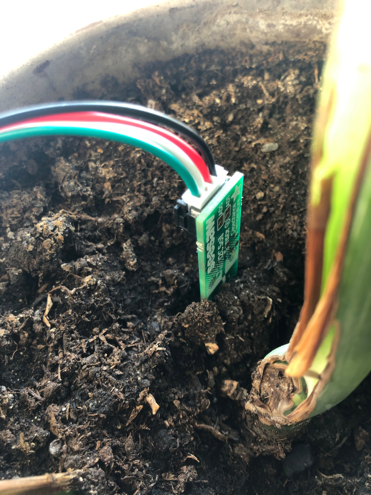

# bnbPlants

@author Samuel Tinnerholm / RealFishSam / st223fu

@time 10m

Say goodbye to dry plants and hello to bnbPlants: the witty, moisture-measuring marvel that keeps your green companions hydrated! bnbPlants measures soil moisture, offers a dashboard, and sends witty reminders to water your plants.

## Video Presentation
<a href="https://www.youtube.com/watch?v=0glz78bLsBI&ab_channel=SamuelTinnerholm" target="_blank">
 
</a>


# Configure & Run Software
## Configure

If you have completed the setup of all the necessary hardware, firmware, and other components, and you simply want to execute the software and start the project:

main.py: 
Replace the following variables with your specific configuration:

1. **SSID**: Replace with your Wi-Fi network name
2. **PASSWORD**: Replace with your Wi-Fi password
3. **API_URL**: Replace with your Datacake API URL
4. **API_DEVICE**: Replace with your Datacake device ID

bnbPlants_bot.js: 
Replace the following variable with your specific configuration:

1. **TOKEN**: Replace with your Telegram bot token
   
Once these configurations have been added, the software should be ready to run.

## Run

Run `node bnbPlants_bot.js` in a terminal, then power up the Raspberry Pi Pico, with main.py. That's it!


# Introduction
Discover the fascinating world of IoT with "bnbPlants," a project that originated during the summer course at Linnaeus University in 2023. This system effectively measures soil moisture and temperature and intelligently predicts the watering needs of your plants. The Raspberry Pi Pico serves as the core component, ensuring optimal growth and hydration for every plant in your garden.

# Objective
The "bnbPlants" project arose from a challenge faced by my mother in caring for the plants at our family's Airbnb property during the off-season summer months. Uncertain watering schedules led to stress and inefficiency. To tackle this issue, "bnbPlants" introduces a soil moisture system that not only monitors soil conditions and temperature but also predicts when the next watering is required. The project includes a user-friendly online dashboard, accessible at any time and from anywhere, providing real-time updates on the plants' needs. Additionally, it will send notifications via Telegram to the user when it's time to water the plants, making the task of plant care effortless and precise even for non-tech-savvy individuals.

# Materials
|Item|Cost (Sek)|Purpose|
|:----:|:----:|:----:|
|[Raspberry Pi Pico WH](https://www.electrokit.com/produkt/raspberry-pi-pico-wh/)|99.19-109.00|Communicates with all components **"The Brain"**|
|Pico Power Supply (any old phone charger)|N/A|Provides power to components **"The Muscles"**|
|[Breadboard (270 connections)](https://www.electrokit.com/produkt/kopplingsdack-270-anslutningar/)|26.10-29.00|Easy wiring due to lack of soldering equipment|
|[Adafruit STEMMA Soil Sensor](https://www.electrokit.com/produkt/jordfuktighetssensor-kapacitiv-i2c/)|115.00|Measures soil moisture & temperature|
|[JST PH 2mm 4-Pin to Female Socket Cable](https://www.electrokit.com/en/product/kabel-med-jst-ph-4-pol-hona-0-64mm-stift-200mm/)|24.00|Connects sensor to Pico|

**Note:**
If you feel confident in your soldering skills, you can readily substitute the Raspberry Pi Pico WH, which comes with pre-soldered headers, with the Raspberry Pi Pico W, which does not have pre-soldered headers, as they are essentially the same.

# Putting It All Together

## Firmware
To successfully complete this project, you will need to have MicroPython installed on a Raspberry Pi Pico W board.

To download MicroPython with Wi-Fi support, press [here](https://micropython.org/download/rp2-pico-w/rp2-pico-w-latest.uf2)

Once you have downloaded MicroPython, please refer to the following video for detailed instructions on how to install MicroPython onto a Pico


More information can be found [here](https://www.raspberrypi.com/documentation/microcontrollers/micropython.html).

## Hardware

### Wiring 


Following Adafruit's [datasheet](https://learn.adafruit.com/adafruit-stemma-soil-sensor-i2c-capacitive-moisture-sensor/overview), and Raspberry Pi's [datasheet](https://datasheets.raspberrypi.com/picow/pico-w-datasheet.pdf?_gl=1*xj3ezv*_ga*MjYwNDYyMTE4LjE2ODY3MzQ5MjU.*_ga_22FD70LWDS*MTY4ODAzNzkxMC40LjEuMTY4ODAzODM2MC4wLjAuMA..) I ended up wiring as above.

|Pi Connection|Adafruit Connection|
|:----:|:----:|
|GP14|I2C SDA|
|GP15|I2C SCL|
|3v3(OUT)|VIN|
|GND|GND|


## Software
### Sensor and Pico Software
Crafting the software was a bit tricky with Adafruit's somewhat unclear [datasheet](https://learn.adafruit.com/adafruit-stemma-soil-sensor-i2c-capacitive-moisture-sensor/overview). While they did offer [sample code for CircuitPython](https://github.com/adafruit/Adafruit_CircuitPython_seesaw/blob/main/examples/seesaw_soil_simpletest.py), there was no MicroPython sample. The CircuitPython [code](https://github.com/adafruit/Adafruit_CircuitPython_seesaw/blob/main/examples/seesaw_soil_simpletest.py) hinted at a seesaw import: `from adafruit_seesaw.seesaw import Seesaw`. A bit of digging in [Adafruit's GitHub](https://github.com/adafruit) led me to [seesaw.py](https://github.com/adafruit/Adafruit_CircuitPython_seesaw/blob/main/adafruit_seesaw/seesaw.py). I pulled key addresses from there and built a custom class for usage in Micropython:
```
# Seesaw soil sensor
class Seesaw:
    def __init__(self, i2c, addr=0x36):
        self.i2c = i2c
        self.addr = addr
        self.temp = bytearray(4)
        self.moist = bytearray(2)

    def get_temp(self):
        # Send request to get temperature (command 0x04)
        self.i2c.writeto(self.addr, bytes([0x00, 0x04]))
        time.sleep(0.1)  # Delay for conversion
        self.i2c.readfrom_into(self.addr, self.temp)
        return 0.00001525878 * ((self.temp[0] & 0x3F) << 24 | self.temp[1] << 16 | self.temp[2] << 8 | self.temp[3])

    def get_moisture(self):
        # Send request to get moisture (command 0x0F)
        self.i2c.writeto(self.addr, bytes([0x0F, 0x10]))
        time.sleep(0.1)  # Delay for conversion
        self.i2c.readfrom_into(self.addr, self.moist)
        return (self.moist[0] << 8 | self.moist[1])
```

After setting up, I ran the code like this:
```
i2c = I2C(1, scl=Pin(15), sda=Pin(14))

ss = Seesaw(i2c)

while True:
    temp = ss.get_temp()
    moist = ss.get_moisture()

    print(f"temp: {temp}  moisture: {moist}")
    time.sleep(1)
```

It outputted proper data points:
|temp|moisture|
|:----:|:----:|
|35.21363|452|
|35.21363|468|
|35.21363|466|
|35.41015|462|
|35.10925|433|

To upload this code to the pico, name the file `main.py`. [Download and install VSCode](https://code.visualstudio.com/download), then install !
the [Pico-W-Go extension](https://marketplace.visualstudio.com/items?itemName=paulober.pico-w-go). Inside VSCode, right-click on your file `main.py` --> Upload Project to Pico, with your pico plugged into your computer.


### Data Visualization 
#### Custom Dashboard
At first, my intention was to create my own dashboard since I have ample experience as a web developer. However, I realized that I lacked proficiency in CSS and decided to expand my knowledge in that area. Here is the outcome of my efforts:

https://github.com/realfishsam/bnbPlants/assets/92118699/aeb77a9d-5f1f-48b2-a057-7a0d57199d2c

Unfortunately, my limited understanding of CSS led to issues with file structure and other aspects, as depicted in the following image:


As a result, my enthusiasm waned, and I lost interest in the project.
Nevertheless, the main factor influencing my decision to transition to Datacake was not solely based on the aforementioned reason; the primary motive behind this move was the cost of maintenance. To effectively run and manage this dashboard, I would be required to host it on a server, which incurs financial expenses. For instance, Linode, one of the largest server providers, offers its most affordable option at a monthly rate of $5, which I do not wish to spend. Given my current situation, where I am frequently on the move, self-hosting also becomes impractical.

[Source code](https://github.com/realfishsam/bnbPlantsDashboard) for the dashboard shown in the video.

I should mention that I followed [this tutorial](https://www.youtube.com/watch?v=kySGqoU7X-s&ab_channel=Hyperplexed) to learn how to create the "blob" effect.

#### Datacake
Utilizing Datacake was quite easy. I relied on [Lecture 08](https://www.youtube.com/watch?v=70DMH_Py9TA&t=1040s&ab_channel=ComputerScienceLNU), as well as [this](https://www.youtube.com/watch?v=eu_dwUTPzkU&t=381s&ab_channel=Datacake) video by Datacake to create my dashboard, with Datacake's webhook.

Here is my step to step guide on how to do it:
1. **Create an account**: Register on [Datacake](https://app.datacake.de/)
2. **Add a device**: After logging in, click on 'devices' on the left menu, and then click the 'Add Device' button in the top right corner.
3. **Set up the device**: Select 'API' and follow the prompts.
4. **Configure the device**: In 'device configuration', navigate to 'HTTP Payload Decoder' and input this JavaScript code:
   ```
     function Decoder(request) {
         var payload = JSON.parse(request.body);
         
         var serial = payload.serial;
         var temperature = payload["data"]["TEMPERATURE"]
         var soil_moisture = payload["data"]["SOIL_MOISTURE"]
         
         return [
             {
             "field": "device",
             "value": serial,
             },
             {
             "device": serial,
             "field": "TEMPERATURE",
             "value": temperature,
             },
             {
                 "device": serial
                 "field": "SOIL_MOISTURE",
                 "value": soil_moisture,
             }
         ]
     }
   ```
   Remember to save this setting.
5. **Add fields**: Under 'configuration' --> 'Fields', add two new fields, 'Temperature' and 'Moisture'. These can be set as Integers or Floats based on the accuracy you need. In my case, I used an Integer for 'Moisture' and a Float for 'Temperature'.
6. **Modify your Python script**: Update 'main.py' to include this Python code:
```
import urequests as requests

def create_json(serial, temperature, moisture):
    """Create a JSON payload with device serial, temperature, and moisture."""
    data = {
        "serial": serial,
        "data": {
            "TEMPERATURE": temperature,
            "SOIL_MOISTURE": moisture,
        },
    }
    return data


def post_data(url, headers, data):
    """Post data to the provided URL with the provided headers."""
    response = requests.post(url, json=data, headers=headers)
    print(response.status_code)
    print(response.text)
```
The above code utilizes Micropython's version of the requests module, specifically urequests, to send data to Datacake.
You can find the full script in 'main.py'.

7. **Add a dashboard**: On the left menu, add a new dashboard and design it according to your preference. Here's an example of how your dashboard might look: 


And there you have it - your data visualized in a user-friendly dashboard!

Due to the limitations of the Datacake free tier, I am only able to send approximately 500 messages per day. To exceed this limit and send more messages, a paid subscription is required.

LoRa connectivity is not available in the area where my parent's BnB is located. Moreover, opting for WiFi makes the initial cost of the complete device cheaper. This is because using LoRa would require additional antennas and related equipment, whereas with WiFi, only the pico device is necessary. Although electricity expenses may be higher in the long term, the device itself remains inexpensive to operate. Additionally, the cost savings from reduced trips to the BnB for my mother, resulting in lower gasoline expenses, further contribute to the overall affordability.

Datacake's webhook was used to send data.

One of the conveniences of using Datacake is that I don't have to manage my own database. However, if I were to choose a database, MongoDB would be my preferred option due to its innovative approach of using JSON-like files. With Datacake's free tier, I can store several hundred datapoints without any cost, enabling me to dedicate my attention to other aspects of the project.

### Real-Time Data Notifications W/ Telegram
In the introductory section, I expressed my desire to notify bnbPlants users regarding when to water their plants. In addition to that, I aim to provide users with updates about soil moisture and other related data.
To accomplish this objective, it was necessary for me to acquire real-time data from Datacake and forward it through Telegram. I opt for Telegram over Discord because my mother (who is my only user), who frequently communicates through Telegram, doesn't use Discord.

To create a Telegram Bot, follow these steps:

1. **Register on Telegram**: Create a Telegram account if you don't already have one.
2. **Engage with BotFather**: Start a chat with BotFather. Initiate the process by sending the "/start" command, then follow the instructions BotFather provides.
3. **Code the Bot**: The final step involves writing the bot. I chose to use JavaScript, my language of choice.

```
// Import required libraries
const TelegramBot = require('node-telegram-bot-api');
const fetchData = require('./cake.js');

// Set up the bot token
const TOKEN = 'YOUR TOKEN HERE';
const bot = new TelegramBot(TOKEN, {polling: true});

let updateInterval = 24;

// Define chatId, intervalId and checkWateringId
let chatId;
let intervalId;
let checkWateringId;

// Counter to check the number of times the plant needed watering consecutively
let wateringCount = 0;

// Function to fetch and deliver status
async function sendStatus() {
    fetchData().then((data) => {
        console.log("Data received from Datacake: ", data);
        data.TEMPERATURE = Math.round(data.TEMPERATURE * 10) / 10;
        data.SOIL_MOISTURE = Math.round( (data.SOIL_MOISTURE / 2000) * 100) ;

        const statusText = `🌫️ Moisture: ${data.SOIL_MOISTURE}%\n🌡️ Temperature: ${data.TEMPERATURE}°C\n🚰 Water in: ${data.DAYS} days`;
        bot.sendMessage(chatId, statusText);
        const seeMoreMessage = `See more at https://app.datacake.de/dashboard/d/de83fefc-12d6-4ee9-87cc-da17489cd981`;
        bot.sendMessage(chatId, seeMoreMessage);
    });
}

// Function to check if plant needs watering and send reminder message if it does
async function checkWateringStatus() {
    fetchData().then((data) => {
      console.log("Checking watering status...")
        if (data.DAYS === 0) {
            console.log("Uh oh, plant needs watering! 🌵" + `Moisture: ${data.moisture / 2000}`);
            wateringCount++;

            if (wateringCount === 5) {
               console.log("Sending reminder message...");
                bot.sendMessage(chatId, "Your plant is parched! 🌵 Please hydrate 💦 it as soon as possible!");
            }
        } else {
            console.log("Plant is fine! 🌱")
            wateringCount = 0; // reset counter if not at zero
        }
    });
}

// Function to fetch and send status at regular intervals
function startUpdateInterval() {
    // Reset the preceding interval if it's present
    if (intervalId) {
        clearInterval(intervalId);
    }

    intervalId = setInterval(sendStatus, updateInterval * 3600000); // Convert updateInterval from hours to milliseconds
}

// Function to check watering status every 10 minutes
function startCheckWateringInterval() {
    // Reset the preceding interval if it's present
    if (checkWateringId) {
        clearInterval(checkWateringId);
    }

    // data is transmitted every 3.33 minutes :)
    checkWateringId = setInterval(checkWateringStatus, (10 / 3) * 60000); // 3.33... minutes in milliseconds
}

// Event handlers for commands
bot.onText(/\/status/, (msg) => {
  chatId = msg.chat.id;
  sendStatus();
});

bot.onText(/\/interval$/, (msg) => {
  const chatId = msg.chat.id;
  bot.sendMessage(chatId, 'Specify a number following the command, like "/interval 24"');
});

bot.onText(/\/interval (.+)/, (msg, match) => {
  chatId = msg.chat.id;
  const resp = match[1];
  if (!isNaN(resp) && isFinite(resp) && resp >= 0.25 && resp <= 168) {
    updateInterval = resp;
    const intervalMessage = resp == 1 ? 'Update interval set to each hour' : `Update interval set to every ${resp} hours`;
    bot.sendMessage(chatId, intervalMessage);
    startUpdateInterval(); // Reset the update interval using the new value
  } else {
    bot.sendMessage(chatId, 'Enter a valid number between 0.25 and 168 for the update interval (in hours)');
  }
});

bot.onText(/\/help/, (msg) => {
  chatId = msg.chat.id;
  bot.sendMessage(chatId, 'Commands:\n/status - Get current plant status\n/interval - Set update interval (in hours)');
});

bot.onText(/\/start/, (msg) => {
  chatId = msg.chat.id;
  bot.sendMessage(chatId, 'Welcome to BnB Plants Bot!');
  bot.sendMessage(chatId, 'Commands:\n/status - Get current plant status\n/interval - Set update interval (in hours)\n/help - Get command list');
  startUpdateInterval(); // Begin the update interval when the bot initiates
  startCheckWateringInterval(); // Begin the watering check interval when the bot initiates
});
```

`cake.js` can be found [here](https://github.com/realfishsam/bnbPlants/blob/main/TelegramBot/cake.js)


In order to execute the code, NodeJS needs to be installed. You can find the installation instructions [here](https://nodejs.dev/en/learn/how-to-install-nodejs/)


# Areas of Improvement and Potential Further Development
1. **Launch of Custom Dashboard**: The Datacake dashboard serves its purpose well. However, a custom dashboard can provide greater flexibility and be tailored specifically to bnbPlants' needs.
2. **Support for Multiple Plants**: At present, the system supports one plant. But users often have more than one plant they would like to monitor.
3. **Mobile App Development**: Instead of a Telegram bot, a dedicated mobile app could offer a more engaging platform for users to receive notifications, access plant data, and adjust care settings conveniently.
4. **Integration with Smart Home Systems**: Considering the prevalence of smart home ecosystems, integrating bnbPlants with Amazon Alexa, Google Home, or Apple HomeKit is an area to explore. Users could leverage voice commands to monitor their plants, adjust care settings, and receive updates.
5. **🚰 Self Watering System**: A significant upgrade would be a self-watering feature using automated pumps linked to a water reservoir. The reservoir could be a refillable container or linked to the home's water supply, with safety measures to prevent overflows. This not only simplifies plant care but ensures consistent watering, even when the user is away.

# Conclusion
The bnbPlants project successfully provides a reliable solution to the common problem of plant care, especially in spaces such as an Airbnb property. The project demonstrates that with the use of relatively inexpensive materials and a bit of creativity, it's possible to create an IoT project that doesn't just measure soil conditions but also delivers critical data to the user in an accessible and user-friendly manner.

This README guide documents the journey of the project from inception to realization, covering the hardware and software aspects. It not only showcases the process of setting up the Raspberry Pi Pico and Adafruit STEMMA Soil Sensor but also the implementation of the Telegram bot and the visualization of the data via Datacake.

While the attempt to build a custom dashboard was met with some challenges, I instead leveraged an existing service, Datacake, for creating a functional and visually pleasing dashboard. This demonstrates an important principle of IoT and programming in general - to use existing tools and resources when they meet the project's needs, allowing us to focus on the unique aspects of our project.

I hope that bnbPlants inspires and assists others in their journey to explore the fascinating world of IoT, and provides a starting point for anyone looking to ensure the well-being of their plants, whether in an Airbnb or their personal home.

# Project Design
## Pictures
<div style="display: flex; justify-content: space-around;">
  
  
  
  
</div>
